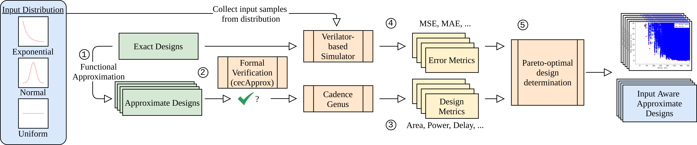

# FV-LIDAC: Formally Verified Library of Input Data Aware Approximate Arithmetic Circuits

<p align="center">
  
</p>


FV-LIDAC (Formally Verified Library of Input Data Aware Approximate Circuits) is a formally verified library of input distribution aware approximate arithmetic circuits. 


<p align="center">
  
</p>

In this repository, the initial multiplier and initial adder designs were taken from [GenMul](https://agra.informatik.uni-bremen.de/s_sca.php?lang=en) (available on [Github](https://github.com/amahzoon/genmul)).
The multipliers and adders are utilized as the starting point in the FV-LIDAC flow (see Step 1).
Through [cecApprox](https://doi.org/10.1109/TCSI.2024.3388256) the circuits a validated, and design metrics and error metrics are determined in order to find the Pareto-optimal designs for a given pair of design metric and error metric.

Please feel free to utilize this library in your research, or applications. 
More information can be found in [our open access publication](https://doi.org/10.1145/3744710).

## Project Structure

The `FV-LIDAC` directory contains subdirectories structured as follows.
First there are subdirectories for addeers and multipliers.
In each of those directories the circuits are split into 8-bit and 16-bit variants.
Per bitwidth, each directory contains a respective directory for each design-error-metric-pair.
For each metric, FV-LIDAC evaluated input distributions sampled from exponential distributions (e),  normal distributions (n), and uniform distributions (u).
The Pareto-optimal circuits are made available in Verilog and Aiger format. 
Each of the directories contains a README file containing the list of Pareto-optimal designs with their respective design metric and error metric.

For example, the Pareto-optimal 16-bit adders for area vs mean average error can be found in `FV-LIDAC/adders/16bit/area-mae/`. 

```
FV-LIDAC/
├── adders
│   ├── 16bit
│   │   ├── area-mae
│   │   │   ├── e
│   │   │   │   ├── aig
│   │   │   │   └── verilog
│   │   │   ├── n
│   │   │   │   ├── aig
│   │   │   │   └── verilog
│   │   │   ├── u
│   │   │   │   ├── aig
│   │   │   │   └── verilog
│   │   │   └── README.md
│   │   ├── area-mse
│   │   ├── delay-mae
│   │   ├── delay-mse
│   │   ├── pwr-mae
│   │   └── pwr-mse
│   └── 8bit
│       ├── area-mae
│       ├── area-mse
│       ├── delay-mae
│       ├── delay-mse
│       ├── pwr-mae
│       └── pwr-mse
└── multipliers
    ├── 16bit
    │   ├── area-mae
    │   ├── area-mse
    │   ├── delay-mae
    │   ├── delay-mse
    │   ├── pwr-mae
    │   └── pwr-mse
    └── 8bit
        ├── area-mae
        ├── area-mse
        ├── delay-mae
        ├── delay-mse
        ├── pwr-mae
        └── pwr-mse

```


## How to cite

Further details on FV-LIDAC are described in the folliwng [publication](https://doi.org/10.1145/3744710):

```
@article{ahmadipour2025fvlidac,
author = {Ahmadi-Pour, Sallar and Parvin, Sajjad and Jha, Chandan Kumar and Drechsler, Rolf},
title = {FV-LIDAC: Formally Verified Library of Input Data Aware Approximate Arithmetic Circuits},
year = {2025},
issue_date = {July 2025},
publisher = {Association for Computing Machinery},
address = {New York, NY, USA},
volume = {30},
number = {4},
issn = {1084-4309},
url = {https://doi.org/10.1145/3744710},
doi = {10.1145/3744710},
abstract = {Approximate circuits have become ubiquitous in error-resilient applications. These circuits provide large reductions in area, power, and delay at the cost of erroneous computations. The error-resilient applications produce acceptable output quality, even after the introduction of erroneous computations. However, we observed that the error resilience of an application varies widely with respect to the applied inputs. Since prior works have mostly focused on using samples from a uniform distribution while designing the approximate circuits, they are unable to exploit input aware properties to design optimal circuits. Hence, in this work, we bridge this gap and propose Formally Verified Library of Input Data Aware Approximate Circuits (FV-LIDAC). FV-LIDAC is the first formally verified library of input distribution aware approximate arithmetic circuits. We use three of the most widely occurring distributions, namely uniform, normal, and exponential distributions, to show that optimal design sets are heavily dependent on the input data. FV-LIDAC chooses the best designs among millions of functional approximated adder and multiplier circuits, depending upon the inputs. Since there are no existing input-aware approximate circuit libraries, we compared FV-LIDAC against state-of-the-art input-unaware EvoApproxLib, to further highlight the need for FV-LIDAC. Additionally, we perform case studies on real-world applications to further highlight the improvement over state-of-the-art. We aim to make the Pareto-optimal designs available as open source to stimulate further research.},
journal={ACM Transactions on Design Automation of Electronic Systems},
month = jul,
articleno = {64},
numpages = {23},
keywords = {Approximate computing, Pareto-optimal, input distribution, adders, multipliers}
}
```

## Acknowledgements

This work was supported by the German Research Foundation (DFG) within the project PLiM (DR 287/35-2 - project number 406079023).

